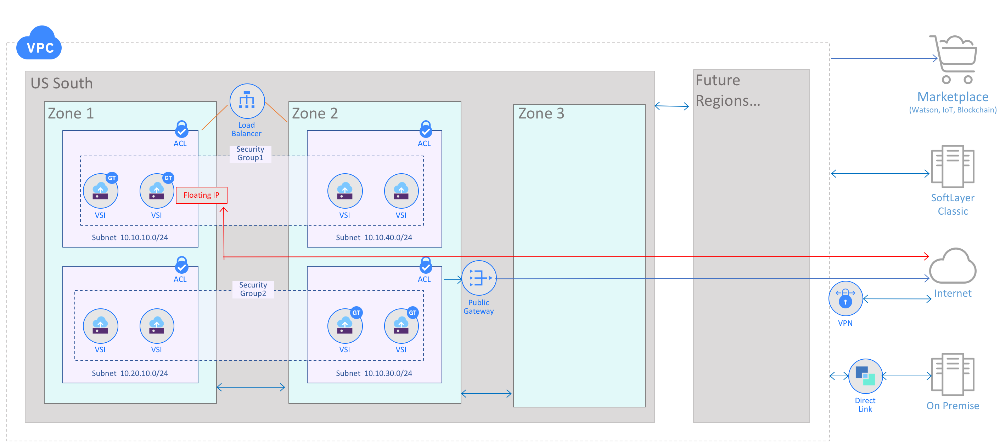

---

copyright:
  years: 2017, 2018
  
lastupdated: "2018-08-07"

---

{:shortdesc: .shortdesc}
{:new_window: target="_blank"}
{:codeblock: .codeblock}
{:pre: .pre}
{:screen: .screen}
{:tip: .tip}
{:download: .download}

# About VPC

A Virtual Private Cloud (VPC) is a virtual network that is tied to your customer account. It offers you a cost-effective entry point that provides cloud security and the ability to scale dynamically with growth. It gives you fine-grained control over your virtual infrastructure and your network traffic segmentation.

IBM Cloud VPC is part of the next generation of the IBM One Cloud platform, which redefines the traditional industry standards for performance, service growth, flexibility, and deployment freedom.

**Features:**

 * For a list of features currently available in our Beta program, please refer to our [Beta Feature List document](about-vpc-beta.html).

 * For a view of the **Planned Experience** as we move from Beta toward GA for IBM Cloud VPC, skip to [this section](about.html#planned-ibm-virtual-private-cloud-experience).
 
 * A Virtual Private Cloud is ideal for cloud-native workloads. [See a detailed list of the key features that IBM Cloud VPC can provide for your workloads](about.html#use-ibm-cloud-vpc-for-cloud-native-workloads).

**Benefits:**

 * Quick to get started using predefined configurations for your instances, called profiles
 * Flexible geographic scope with zones and regions available globally
 * Secure from the ground up, with ACLs and security groups
 * Easily scalable and sharable, a VPC network and resources can stretch from your on-premise facility into your cloud
 * Monitor your workloads for optimal performance and efficiency

IBM Cloud VPC offers an isolated, security-rich environment. It gives you the security of a private cloud, with the agility and ease of use of a public cloud. With IBM Cloud VPC, you can manage key network services and launch Virtual Servers as needed to support your mission-critical, cloud-based applications.

## How it works

The IBM Cloud VPC offering provides logical isolation from other networks in all regions. A Virtual Private Cloud is subdivided into subnets of various sizes, using a range of private IP addresses, depending on user need. Subnets are contained within a single Zone, so they cannot span Zones--but the entire IBM Cloud VPC can consist of resources in one or more Zones. By default, all resources (such as VSIs) within the same Virtual Private Cloud can communicate to each other, regardless of their subnet.

Additional information about how VPC works is available in these documents:

 * More details about [connectivity](vpc-connectivity.html) 
 * More details about [security](vpc-security.html)
 * Concepts about how IBM Cloud VPC works with [subnets and regions](vpc-regions-and-subnets.html).

**Note: For the Beta release, there is only one Zone and one Region.**

### Terminology 
 
For general definitions of IBM Virtual Private Cloud terminology, see the [glossary](vpc-glossary.html).

## Use IBM Cloud VPC for cloud-native workloads

IBM Cloud Virtual Private Cloud (VPC) focuses on cloud-native workloads. You can create the best cloud for your cognitive, AI, and Machine Learning workloads, which are important types of cloud-native workloads. Meanwhile, you can continue to utilize IBM Cloud Classic for traditional workloads, as desired.

The feature sets that follow are part of the **Planned IBM Cloud VPC experience**, and most are already available in the Beta release.

### General requirements for Cloud-Native workloads:

 * To create & manage isolated application environments through the API
 * Network topologies with BYOIP
 * Security Groups and Network Access Control List (ACLs) that allow flexible, API-driven topologies
 * Availability Zones with high-speed & low-latency connections across regions
 * Auto-scaling for groups
 * Scaling up or down by 1000s of servers per day
 * Scalable & reliable load balancing with certificate management
 * Scalable & reliable monitoring
 * Illusion of infinite capacity 

### Specific IaaS Requirements for a Cloud Native Workload:

 * Scalable virtual networks
 * Support for availability zones (HA)
 * High-speed networking and storage
 * Always On services (control plane)
 * Multiple regions for disaster recovery and resilience (Multiple regions coming soon)
 * Most core services:  IPAM, VPN, firewalls, SSH, DNS & L4 Load Balancing
 * Other services: auto-scaling, CDNs, 3rd-party NFV
 * Fast VM provisioning with affinity and anti-affinity
 * Scale (10,000+ servers at times)
 * Flexible image management
 * Support for GPUs

**Note:**

 * VSI Fast Provisioning is being handled separately, not as part of VPC.  
 * Virtual Private Cloud does not provide E2E encryption, but supports it.
 
## Planned IBM Virtual Private Cloud Experience

This section describes what we aim to deliver as we move from Beta toward GA in our timeline.

IBM Virtual Private Cloud (IBM Cloud VPC) combines a fully-virtualized, software-defined networking experience, with superior isolation in the IBM public cloud. It supports your mission-critical applications and a variety of connectivity options. With IBM Cloud VPC, you can provision your resources and connect them to each other, or isolate them from one another. You can define your own networking policies designed for security and convenient access. 

## Networking Capabilities

IBM Cloud VPC offers a comprehensive set of networking capabilities, including IP address range selection, virtual firewalls, site-to-site Virtual Private Networks (VPN), and Load Balancing (LBaaS) with elasticity.

You can configure your virtual topology automatically, using suggested prefix ranges and pre-configured network policies. Later, you can customize your IBM Cloud VPC and adapt it to your changing requirements, seamlessly. In addition, you have the ability both to bring your own private IP and to assign a floating IP.

## Global Connectivity

You can scope your applications and available resources locally or globally, without bounds, to span across multiple regions. Using VPN, you can create private connections to other projects and other portions of your hybrid cloud deployments.

## Network Security

Security is integrated into your IBM Cloud VPC, with security groups that act as virtual firewalls for instance-level protection, and with access control lists (ACLs) for subnet-level protection. 

## Load Balancing

Within your IBM Cloud VPC, use Load Balancing to distribute your network traffic across a set of targets to improve performance and HA. Load Balancers also monitor the health of your applications and services. You can set up a Load Balancer to distribute incoming application traffic across instances in a single Zone or across multiple Zones.

## Internet Access

Using a Public Gateway (PGW) you can enable your virtual server instances (VSIs) to communicate with the public internet, if you choose. There is no charge for using a PGW, except for the bandwith used.

**Figure: The Planned IBM Cloud VPC Experience**

