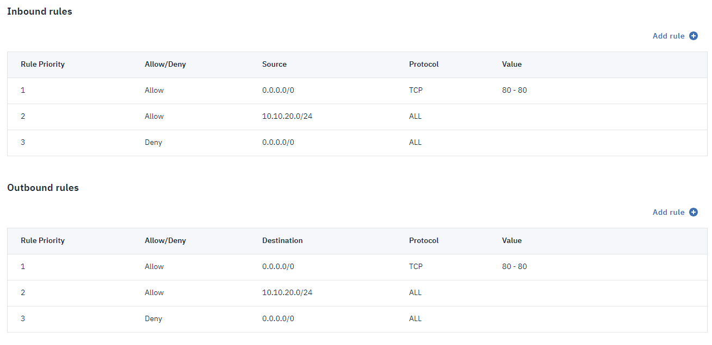

---

copyright:
  years: 2018
lastupdated: "2018-07-18"

---

{:shortdesc: .shortdesc}
{:new_window: target="_blank"}
{:codeblock: .codeblock}
{:pre: .pre}
{:screen: .screen}
{:tip: .tip}
{:download: .download}

# Creating a VPC using the {{site.data.keyword.cloud_notm}} console (Beta)

This guide shows you how to create and configure an {{site.data.keyword.cloud}} Virtual Private Cloud using {{site.data.keyword.cloud_notm}} console.

Follow these steps to create and configure your virtual private cloud (VPC) and other attached resources:

1. Create a VPC and subnet to define the network.
1. Configure an access control list (ACL) to limit the subnet's inbound and outbound traffic. By default, all traffic is allowed.
1. Create a virtual server instance.
1. Configure a security group to define the inbound and outbound traffic that's allowed for the instance.
1. Reserve and associate a floating IP address to enable your instance to communicate with the internet.
1. Create a virtual private network (VPN) so your VPC can connect securely to another private network, such as your on-premises network or another VPC.

## Before you begin

Ensure that you have sufficient permissions to create and manage resources in your VPC. For a list of required permissions, see [Granting permissions needed for VPC users](vpc-user-permissions.html).

Generate an SSH key, which will be used to connect to the virtual server instance. For example, generate an SSH key on your Linux server by running the command `ssh-keygen -t rsa -C "user_ID"`. That command generates two files. The generated public key is in the `<your key>.pub` file.

## Opening {{site.data.keyword.cloud_notm}} console

Go to the [VPC Getting Started ]( https://console.bluemix.net/is) page in {{site.data.keyword.cloud_notm}} console.

## Creating a VPC and subnet

To create a VPC and subnet:

1. Click **Create VPC** on the Getting Started page.
1. Enter a name for the VPC, such as `my-vpc`.
1. Select or create the default ACL for new subnets in this VPC. In this tutorial, let's create a new default ACL. We'll configure rules for the ACL later.
1. Enter a name for the new subnet in your VPC, such as `my-subnet`.
1. Select a location for the subnet. The location consists of a region and a zone. For this Beta release, only one location is available.
1. Enter an IP range for the subnet in CIDR notation, for example: `10.240.0.0/22`.
1. Select an ACL for the subnet. Let's select **Use VPC default** to use the default ACL that's created for this VPC.
1. Attach a public gateway to the subnet to allow all attached resources to communicate with the public internet.  
**Tip**: You can also attach the public gateway after you create the subnet.
1. Click **Create virtual private cloud**.
1. To create another subnet in this VPC, click the **Subnets** tab and click **New subnet**. When you define the subnet, make sure to select `my_vpc` in the **Virtual private cloud** field. 

## Configuring the ACL 

You can configure the ACL to limit inbound and outbound traffic to the subnet. By default, all traffic is allowed.

Each subnet can be attached to only one ACL. However, an ACL can be attached to multiple subnets. 

To configure the ACL:

1. On the VPC and subnets page, click the **Subnets** tab.
1. Click the subnet that you created.
1. In the **Subnet details** area, click the name of the ACL.
1. Click **Add rule** to configure inbound and outbound rules that define what traffic is allowed in or out of the subnet.  For each rule, specify the following information:  
   * Specify the rule's priority. Rules with lower numbers are evaluated first and override rules with higher numbers. For example, if a rule with priority 2 allows HTTP traffic and a rule with priority 5 denies all traffic, HTTP traffic is still allowed.  
   * Select whether to allow or deny the specified traffic.  
   * Specify a CIDR block to indicate the IP range that the rule applies to. 
   * Select which protocols and ports the rule applies to.
1. When you finish creating rules, click the **All access control lists** breadcrumb at the top of the page.

### Example ACL

For example, you can configure inbound rules that do the following:

 1. Allow HTTP traffic from the internet 
 1. Allow all inbound traffic from the subnet 10.10.20.0/24
 1. Deny all other inbound traffic  

Then, configure outbound rules that do the following:

1. Allow HTTP traffic to the internet 
1. Allow all outbound traffic to the subnet 10.10.20.0/24
1. Deny all other outbound traffic  

## Creating a virtual server instance

To create a virtual server instance in the newly created subnet:

1. Click **Virtual server instance** in the navigation pane and click **New instance**.
1. Enter a name for the instance, such as `my-instance`.
1. Select the VPC that you created.
1. Note the **Location** field (read-only) that shows the location of the subnet on which the instance is created.
1. Select an image (that is, operating system and version) such as Ubuntu 16.04.
1. To set the instance size, select one of the popular profiles or click **All profiles** to choose a different core and RAM combination that's most appropriate for your workload.
1. Select an existing SSH key or add an SSH key that will be used to access the virtual server instance. To add an SSH key, click **Add SSH key** and name the key. After you enter your previously generated public key value, click **Add SSH key**.
1. _Optional:_ Enter user data or metadata for the instance. This data is typically used with custom provisioning scripts. For more information, see [User Data](/docs/vsi-is/vsi_is_provisioning_scripts.html).
1. Note the boot volume. For the Beta release, 100 GB is allotted for the boot volume.
1. In the **Network interfaces** area, you can change the name and port speed of the interface. If you have more than one subnet in your VPC, you can select the subnet that you want to attach to the instance. 

   You can also select which security groups to attach to this instance. By default, the VPC's default security group is attached. The default security group allows inbound SSH and ping traffic, all outbound traffic, and all traffic between instances in the group. All other traffic is blocked; you can configure rules to allow additional traffic. If you later edit the rules of the default security group, those updated rules will apply to all current and future instances in the group.
1. Click **Create virtual server instance**.

## Configuring the security group for the instance

You can configure the security group to define the inbound and outbound traffic that is allowed for the instance.

To configure the security group:

1. On the Virtual server instances page, click your new instance to view its details.
1. In the **Network interfaces** section, click the security group.
1. Click **Add rule** to configure inbound and outbound rules that define what traffic is allowed to and from of the instance. For each rule, specify the following information:  
   * Select which protocols and ports the rule applies to.   
   * Specify a CIDR block or IP address for the permitted traffic. Alternatively, you can specify a security group in the same VPC to allow traffic to or from all instances of the selected security group.    

   **Tips:**  
  * All rules are evaluated, regardless of the order in which they're added. 
  * Rules are stateful, which means that return traffic in response to allowed traffic is automatically permitted. For example, a rule that allows inbound TCP traffic on port 80 also allows replying outbound TCP traffic on port 80 back to the originating host, without the need for an additional rule.
1. _Optional:_ If you want to attach this security group to other instances, click **Attached interfaces** in the navigation pane  and select additional interfaces.
1. When you finish creating rules, click the **All security groups** breadcrumb at the top of the page.

### Example security group  

For example, you can configure inbound rules that do the following:

 * Allow all SSH traffic (TCP port 22)
 * Allow all ping traffic (ICMP type 8)
 
Then, configure outbound rules that allow all TCP traffic.

## Reserving a floating IP address

Reserve and associate a floating IP address to enable your instance to be reachable from the internet
**Tip:** Your instance must be running before you can associate a floating IP address. It can take a few minutes for the instance to be up and running.

To reserve and associate a floating IP address:

1. In the left navigation pane, click **Floating IP**.
1. Click **Reserve floating IP**.
1. Select the instance that you created and its network interface that you want to associate with the floating IP address.
1. Click **Reserve IP**. The new IP address is displayed on the Floating IPs page.

## Connecting to your instance

Using the floating IP address that you created, ping your instance to make sure it's up and running:

`ping <public-ip-address>`

Since you created your instance with a public SSH key, you can now connect to it directly by using your private key:

`ssh -i <path-to-private-key-file> root@<public-ip-address>`

## Monitoring your instance

You can monitor the CPU, volume, memory, and network usage of your instance over time.

To monitor your instance:

1. Click **Virtual server instance** in the navigation pane.
1. Click the name of your instance.
1. Click **Monitoring** in the navigation pane. 

For an activity log that shows when the instance was started, stopped, or rebooted, click **Activity** in the navigation pane.

## Creating a VPN
You can create a virtual private network (VPN) so your VPC can connect securely to another private network, such as an on-premises network or another VPC. 

To create a VPN:
1. In the navigation pane, click **VPNs**.
1. On the VPN page, click **New VPN gateway** and specify the following information:
    * **Name**: Enter a name for the VPN gateway in your virtual private cloud, such as `my-vpn-gateway`.
    * **Virtual private cloud**: Select your VPC.
    * **Subnet**: Select a subnet in the region where you want to create the VPN gateway. For this Beta release, only one region is available. 
1. In the **New VPN connection** section, define a connection between this gateway and a network outside of your VPC by specifying the following information.
    * **Connection name**: Enter a name for the connection, such as `my-connection`.
    * **Peer gateway address**: Specify the IP address of the VPN gateway for the network outside of your VPC.
    * **Preshared key**: Specify the authentication key of the VPN gateway for the network outside of your VPC.
    * **Local subnets**: Specify one or more subnets in the VPC you want to connect through the VPN tunnel.
    * **Peer subnets**: Specify one or more subnets in the other network you want to connect through the VPN tunnel.
1. To configure how the cloud gateway sends messages to check that the peer gateway is active, specify the following information in the **Dead peer detection** section.
    * **Dead peer detection action**: The action to take if a peer gateway stops responding. For example, select **Restart** if you want the gateway to immediately renegotiate the connection.
    * **Interval**: How often to check that the peer gateway is active. By default, messages are sent every 30 seconds.
    * **Timeout**: How long to wait for a response from the peer gateway. By default, a peer gateway is no longer considered active if a response isn't received within 120 seconds.
1. Specify the IKE and IPsec security parameters for the connection. 
    * Select **Auto** if you want the cloud gateway to try to automatically establish the connection. 
    * Select or create custom policies if you need to enforce particular security requirements, or the VPN gateway for the other network doesn't support the security proposals that are tried by auto-negotiation.

  **Important**: The IKE and IPsec security parameters that you specify for the connection must be the same parameters that are set on the gateway for the network outside of your VPC.

## Congratulations!

You've successfully created and configured a VPC and subnet, an ACL, a virtual server instance, security group, floating IP address, and VPN. You can continue to develop your VPC by adding more instances, subnets, and other resources.
