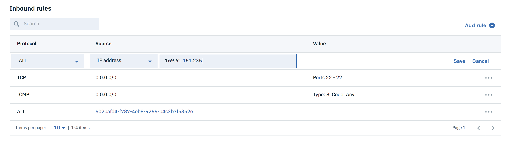
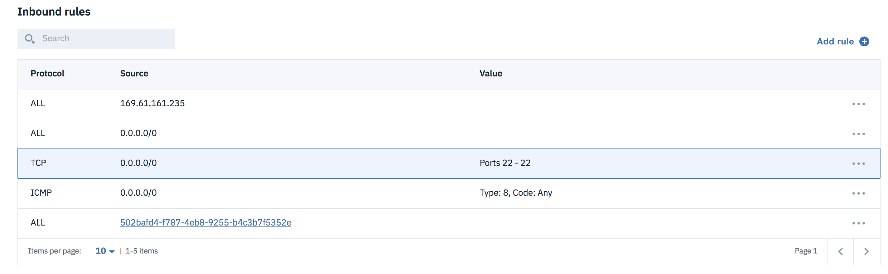
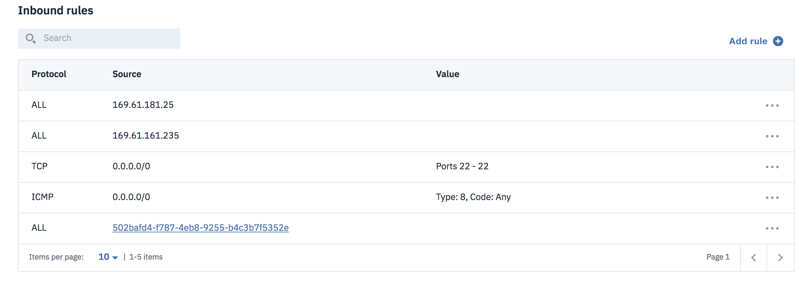

---

copyright:
  years: 2017, 2018
lastupdated: "2018-08-10"

---

{:shortdesc: .shortdesc}
{:codeblock: .codeblock}
{:screen: .screen}
{:new_window: target="_blank"}
{:pre: .pre}
{:tip: .tip}
{:table: .aria-labeledby="caption"}
{:download: .download}

- [Creating VPC resources examples using CLI and API](#creating-vpc-resources-examples-using-cli-and-api)
  - [Guide on VPC, Subnet, Public Gateway, SSH Key, Virtual Server Instance (VSI), and Floating IP](#guide-on-vpc-subnet-public-gateway-ssh-key-virtual-server-instance-vsi-and-floating-ip)
    - [Reference](#reference)
    - [Create VPC](#create-vpc)
    - [Create subnet](#create-subnet)
    - [Create a Public Gateway](#create-a-public-gateway)
    - [Create an SSH Key](#create-an-ssh-key)
    - [Choose a Profile and Image for your Virtual Server Instance](#choose-a-profile-and-image-for-your-virtual-server-instance)
    - [Provision a Virtual Server Instance](#provision-a-virtual-server-instance)
    - [Have VPC instance ready (Knowing the directory of SSH key and subnets' public IP )](#have-vpc-instance-ready-knowing-the-directory-of-ssh-key-and-subnets-public-ip)
      - [Locate the private key file paired with the server](#locate-the-private-key-file-paired-with-the-server)
      - [Know your floating IP address](#know-your-floating-ip-address)
  - [Handbook to setup and get your resources info](#handbook-to-setup-and-get-your-resources-info)
    - [How to choose IPv4 for your VPC](#how-to-choose-ipv4-for-your-vpc)
    - [Get resources info](#get-resources-info)
- [Getting started](#getting-started)
  - [Transferring files to instances](#transferring-files-to-instances)
  - [Hosting local server using python](#hosting-local-server-using-python)
    - [Protocol explanation for ACL and Security Group rules](#protocal-explanation-for-acl-and-security-group-rules)
  - [Part 1: connectivity between server from same zone and vpc](#part-1-connectivity-between-server-from-same-zone-and-vpc)
  - [Part 2: connectivity between server from different zone and vpc](#part-2-connectivity-between-server-from-different-zone-and-vpc)

# Creating VPC resources examples using CLI and API

This file gives examples of how to create and use your VPC resources with the model below.


As the figure illustrates, you have two web servers dealing with requests from the Internet and two backend servers that you want to hide from the public. In this example, you place the servers into two separate subnets, 10.10.10.0/24 and 10.10.20.0/24 respectively, and you need to allow the web servers to exchange data with the backend servers. Also, you want to allow limited outbound traffic in the backend servers.

## [Guide on VPC, Subnet, Public Gateway, SSH Key, Virtual Server Instance (VSI), and Floating IP](example-code.html)

You can connect to your instance of VPC using SSH tools. Before you connect to the instance, here's how to prepare:

- Install the [IBM Cloud CLI Cloud Developer Tools](https://github.com/IBM-Cloud/ibm-cloud-developer-tools)
  - IDT MacOS & Linux Installation:
    ```
    $ curl -sL http://ibm.biz/idt-installer | bash
    ```
  - IDT Windows Installation: Open Windows PowerShell by right-clicking and select "Run as Administrator" then run this command
    ```
    Set-ExecutionPolicy Unrestricted; iex(New-Object Net.WebClient).DownloadString('http://ibm.biz/idt-win-installer')
    ```

- Install or update the `infrastructure-service` plugin to the IBM Cloud CLI
  - Install: `ibmcloud plugin install infrastructure-service`
  - Update: `ibmcloud plugin update`

- The VPC CLI actions use the extension `is`. Run `ibmcloud is help` for usage.

- Log in to IBM CLoud
  - If you have a federated account:`ibmcloud login -sso` otherwise `ibmcloud login`
  - Store the VPC endpoint in a variable, for example, `$rias_endpoint` for later use.
  - Store IAM token in a variable, for later use. For example: `iam_token=$(ibmcloud iam oauth-tokens | awk '/IAM/{ print $4; }')`

### Reference

- [VPC Beta API Reference](apis.html)
- [IBM Cloud VPC Beta CLI Reference](cli-reference.html)

### Create VPC

Create an IBM Cloud VPC called `my-vpc`.

```bash
curl -X POST $rias_endpoint/v1/vpcs \
  -H "X-Auth-Token:$iam_token" \
  -d '{
      	"is_default": true,
      	"name": "my-vpc"
      }'
```
{: codeblock}

For the rest of the calls, you'll need to know the ID of the newly created IBM Cloud VPC. Paste its ID into the variable, as shown:

```bash
# Something like this: `vpc="35fb0489-7105-41b9-99de-033fae723006"`
vpc="<YOUR_VPC_ID>"
```
{: codeblock}

### Create subnet

Create 2 subnets in your VPC. In this example, we will create them in the `us-south-2` zone.

```bash
curl -X POST $rias_endpoint/v1/subnets \
  -H "X-Auth-Token:$iam_token" \
  -d '{
        "name": "my-subnet-1",
        "ipv4_cidr_block": "10.10.10.0/24",
        "zone": { "name": "us-south-2" },
        "vpc": { "id": "'$vpc'" }
      }'

curl -X POST $rias_endpoint/v1/subnets \
  -H "X-Auth-Token:$iam_token" \
  -d '{
        "name": "my-subnet-2",
        "ipv4_cidr_block": "10.10.20.0/24",
        "zone": { "name": "us-south-2" },
        "vpc": { "id": "'$vpc'" }
      }'
```
{: codeblock}

Save the IDs of the subnets in variables so we can use them later.

```bash
# Something like this: `subnet="35fb0489-7105-41b9-99de-033fae723006"`
subnet1="<YOUR_SUBNET1_ID>"
subnet2="<YOUR_SUBNET2_ID>"

```
{: codeblock}

### Create a Public Gateway

To allow virtual server instances in the subnet to have access to the public internet, add a public gateway (PGW) to subnet1.  
```bash
curl -X POST $rias_endpoint/v1/public_gateways -H "X-Auth-Token:$iam_token"
-d '{
  "name": "my-gateway",
  "floating_ip": {
    "address": "203.0.113.1"
  },
  "resource_group": {
    "id": "56969d60-43e9-465c-883c-b9f7363e78e8"
  },
  "vpc": {
    "id": "4727d842-f94f-4a2d-824a-9bc9b02c523b"
  },
  "zone": {
    "name": "us-south-1"
  }
}'
```
{: codeblock}

Save the ID of the public gateway in a variable.

```bash
# Something like this: `gateway="35fb0489-7105-41b9-99de-033fae723006"`
gateway="<YOUR_GATEWAY_ID>"
```
{: codeblock}

### Create an SSH Key

[How to generate an SSH Key](https://git.ng.bluemix.net/help/ssh/README.md)

To generate a new SSH key pair `ssh-keygen -t rsa -C "your.email@example.com" -b 4096`

This key is used when creating the virtual server instance, and it is needed to log into the virtual server instance.

```bash
curl -X POST $rias_endpoint/v1/keys \
  -H "X-Auth-Token:$iam_token" \
  -d '{
        "name": "my-key",
        "public_key": "ssh-rsa AAA....n",
        "type": "rsa"
      }'
```
{: codeblock}

Save the ID of the key in a variable.

```bash
# Something like this: `key="35fb0489-7105-41b9-8764-033fae723006"`
key="<YOUR_KEY_ID>"
```
{: codeblock}

### Choose a Profile and Image for your Virtual Server Instance

Run the APIs to list all profiles and images available for your virtual server instance, and choose a combination.

```
curl $rias_endpoint/v1/instance/profiles -H "X-Auth-Token:$iam_token" | json_pp
```
{: codeblock}

To get additional details about the profiles, you can query the global catalog using the IBM Cloud CLI command `ibmcloud catalog entry <profile-name> --json`. For example,

```
ibmcloud catalog entry b-2x8 --json
```
{: codeblock}

```
curl $rias_endpoint/v1/images -H "X-Auth-Token:$iam_token" | json_pp
```
{: codeblock}

Save the Name of the profile and the ID of the image in variables, which will be used later to provision a virtual server instance.

```bash
# Something like this: `profile_name="b1-2x4"`
profile_name="<CHOSEN_PROFILE_NAME>"
# Something like this: `image_id="660198a6-52c6-21cd-7b57-e37917cef586"`
image_id="<CHOSEN_IMAGE_ID>"
```
{: codeblock}

### Provision a Virtual Server Instance

Provision a virtual server instance in the newly created subnet. Pass in your public SSH key so that you can log in after the instance is provisioned.

```bash
curl -X POST $rias_endpoint/v1/instances \
  -H "X-Auth-Token:$iam_token" \
  -d '{
        "name": "server-1",
        "type": "virtual",
        "zone": {
          "name": "us-south-2"
        },
        "vpc": {
          "id": "'$vpc'"
        },
        "primary_network_interface": {
          "port_speed": 1000,
          "subnet": {
            "id": "'$subnet1'"
          }
        },
        "keys":[{"id": "'$key'"}],
        "flavor": {
          "name": "'$profile_name'"
         },
        "image": {
          "id": "'$image_id'"
         },
        "userdata": ""
      }'
```
{: codeblock}

As you did with the other resources, save the ID of the virtual server instance in a variable.

```bash
# Something like this: `server="35fb0489-7105-41b9-99de-033fae723006"`
server="<YOUR_SERVER_ID>"
```
{: codeblock}

*Repeat the process with Subnet2*

You can find more information, including examples about how to provision a virtual server instance with security groups, in our [Security Group Usage Examples document](security-group-usage-examples.html).

### Have VPC instance ready (Knowing the directory of SSH key and subnets' public IP )

#### Locate the private key file paired with the server

- Windows Command Prompt:

```
type %userprofile%\.ssh\id_rsa.pub
```

- Git Bash on Windows / GNU/Linux / macOS / PowerShell:

```
cat ~/.ssh/id_rsa.pub
```
If you see a string starting with `ssh-rsa` you already have an SSH key pair
and you can skip the generate portion of the next section and skip to the copy
to clipboard step.
If you don't see the string or would like to generate a SSH key pair with a
custom name continue onto the next step.

Note that Public SSH key may also be named as follows:

- id_dsa.pub
- id_ecdsa.pub
- id_ed25519.pub

#### Know your floating IP address

- Use `ibmcloud is instances` to look for your instance detail.
- Save your instance ID and then get network_interfaces ID by query

```
curl $rias_endpoint/v1/instances/$server -H "X-Auth-Token: $iam_token" | json_pp
```

- Look for network_interfaces ID and save it `network_interface="<YOUR_NETWORK_INTERFACE_ID"`

**Note: You can't get the primary network interface until you query the specific VSI.**

- Create a Floating IP

Create a floating IP for the virtual server instance, by using the instance's primary network interface as the target for the new floating IP address.

```bash
curl -X POST $rias_endpoint/v1/floating_ips \
  -H "X-Auth-Token:$iam_token" \
  -d '{
        "name": "my-server-floatingip",
        "target": {
            "id":"'$network_interface'"
        }
      }
'
```
{: codeblock}

Save the ID of the floating IP.

```bash
# Something like this: `floating_ip="35fb0489-7105-41b9-99de-033fae723006"`
floating_ip="<YOUR_FLOATING_IP_ID>"
```
{: codeblock}

- To look for floating ip address `ibmcloud is ip $floating_ip`. You should be able to identify the public address.

## Handbook to setup and get your resources info

### How to choose IPv4 for your VPC

Use CIDR notation: `<IPv4 address>/number` (VPC address ex: 10.10.0.0/16). You want to reserve the last 16  bits (65,536 addresses) of the IPv4 as 0s so that you can use them for varies subnet IP within the same VPC (Subnet IP address ex: 10.10.1.0/24).

This convention is recommmended by RFC 1918 range.

### Get resources info

This quick CLI guide is useful to get back to where you left off.

- To login use `ibmcloud login [-sso]`
- To get VPCs info use `ibmcloud is vpcs`. Then save the vpc ID for later use. You can view vpc detail using `ibmcloud is vpc [vpc_id]` or

```bash
curl $rias_endpoint/v1/vpcs \
  -H "X-Auth-Token:$iam_token" | json_pp
```
{: codeblock}

- To get subnets info use `ibmcloud is subnets`. Then save the subnet ID for later use. You can view subnet detail using `ibmcloud is subnet [subnet_id]` or
- To get instances info use `ibmcloud is instances`. Then save the instance ID for later use. You can view instances detail using `ibmcloud is instance [instance_id]`
- To get floating IPs info use `ibmcloud is floating-ips`. Then save the floating IP for later use. You can view floating IP detail using `ibmcloud is vpc [floating-ips_id]`
- To get regions and endpoints use `ibmcloud is regions`.
- To get zones info use is `ibmcloud is zones _region-name_ (For example, _us-south_)`

# Getting started

1. To connect to your instance, use your private key and run the following command:

  ```
  $ ssh -i Users/UserName/.ssh/yourkey root@169.61.161.235
  ```
  {:codeblock}

   You receive a response similar to the following example. When prompted to continue connecting, type `yes`.

  ```
   The authenticity of host 'xxx.xxx.xxx.xxx (xxx.xxx.xxx.xxx)' can't be established.
   ECDSA key fingerprint is SHA256:abcdef1Gh/aBCd1EFG1H8iJkLMnOP21qr1s/8a3a8aa.
   Are you sure you want to continue connecting (yes/no)? yes
   Warning: Permanently added 'xxx.xxx.xxx.xxx' (ECDSA) to the list of known hosts.
  ```
  {:screen}

   You are now accessing your server.
- Usually ssh keygen will allocate key pairs inside `/Users/username/.ssh`
- Floating IP can be found on your instance via UI. To use CLI: `ibmcloud is floating-ips`

2. After your environment is set up, you can make some sample code to test its functionality.

3. Create a file using Linux (CentOS)
- Make a directory
    ```bash
    # mkdir helloworld
    ```
    {:codeblock}

- Go to the directory and make a Python file
    ```bash
    # cd helloworld
    # vi hello.py
    ```
    {:codeblock}

- Use the `vim` editor to edit the Python file  `print(" Hello, World!")`

- Run the Python file

   ```bash
   # python hello.py
    ```
  {:codeblock}

    You should see `Hello, World!` on the terminal

## Transferring files to instances

To store files on the server, you can transfer a file to your instance using the floating IP. For example, transfer `MyFile.tar.gz` to the instance's root directory

    ```
    $ scp -i Users/UserName/.ssh/yourkey currentDirectory/MyFile.tar.gz root@169.61.161.235:~
    ```
*Enter yes for prompts*

Here's how to retrieve the file `MyFile.tar.gz` from the server (that is, the reverse direction) and rename it to `MyFileLocal.tar.gz`

    ```
    $ scp -i Users/UserName/.ssh/yourkey root@169.61.161.235:~/MyFile.tar.gz ~/MyFileLocal.tar.gz
    ```
*Note: You can also use other tools such as VPN, PuTTY, WSL, and MindTerm to connect to the instance.*


## Hosting local server using python

### [Protocol explanation for ACL and Security Group rules](https://superuser.com/questions/1044361/why-icmp-is-different-that-tcp-and-udp)

ICMP is a control protocol, meaning it is designed not to carry application data, but rather information about the status of the network itself. The best-known example of ICMP in practice is the ping utility, which uses ICMP to probe remote hosts for responsiveness and overall round-trip time of the probe messages.

Both Transmission Control Protocol (TCP) and User Datagram Protocol (UDP) are transportation protocols; they are used to pass the actual data. The main difference between TCP and UDP is that TCP is a connection-oriented protocol, it guarantees that all sent packets will reach the destination in the correct order.

UDP, on the other hand, is a connection-less protocol. Communication is datagram oriented, so the integrity is guaranteed only on the single datagram. Datagrams reach a destination and can arrive out of order or don not arrive at all. It is generally used for real-time communication, where a little percentage of the packet loss rate is preferable to the overhead of a TCP connection.

## Part 1: connectivity between server from same zone and vpc

After creating 2 or more instances in the same subnet that has public gateway attached, we can test their connectivity by hosting a server with html code in one instance, then curl to that server and download the html file on the others or from your computer browser.

Suppose you have instance_1 and instance_2 in the same subnet that has public gateway and same security group. You need to add rules using the API, CLI, or UI for the instance in security groups to allow inbound accesses. If you host your server on instance_1 You need to add rule for instance_2 floating IP. For example, you have instance_1 hosting server with IPv4 be 169.61.161.161 and instance_2 with IPv4 be 169.61.161.235 tries to GET the file from instance_1. It should look like this:



- To list all security groups `ibmcloud is sgs`
- API request that to get the result above

```
curl -X POST $rias_endpoint/v1/security_groups/{security_group_id of instance_1}/rules
-H "X-Auth-Token:$iam_token" -d '{
  "direction": "ingress",
  "protocol": "all",
  "ip_address": "169.61.161.235"
}'
```


1. create an basic `index.html` file on instance_1. Example of basic html file:

```
<!DOCTYPE html>
<html>
<body>

<h1>You have successfully connected to the instance</h1>
<p>Hello, world!</p>

</body>
</html>
```

2. At the same directory where the file located run `python -m SimpleHTTPServer <port number>`. You can use different port if default port 8000 is already in use.

3. SSH into instance_2
- To look for floating ip address do `ibmcloud is ips`, identify the floating_ip id then `ibmcloud is ip $floating_ip_id`. You should be able to identify the public address.

4. Identify IP address of instance_1

5. Use `curl -X GET http://IP_address:Port_number/index.html` to request to download index.html from the hosting server instance_1. (ex: `curl -X GET http://169.61.161.161:8000/index.html`)

6. You should be able to see the output of `index.html`

7. (To access server via local computer browser) Add rules for all inbound traffic as below



- To add rules for allowing ALL protocol and from every source to your security groups

```
curl -X POST $rias_endpoint/v1/security_groups/{security_group_id}/rules/{instance_id} -H "X-Auth-Token:$iam_token" -d '{
  "direction": "ingress",
  "remote": {
    "cidr_block": "0.0.0.0/0"
  }
}'
```

For more detail request example:

```
curl -X POST $rias_endpoint/v1/security_groups/{security_group_id}/rules
-H "X-Auth-Token:$iam_token" -d '{
  "direction": "ingress",
  "port_max": 22,
  "port_min": 22,
  "protocol": "tcp",
  "remote": {
    "cidr_block": "131.121.0.0/24"
  }
}'
```

8. Open a web browser then enter http://IP_address:Port_number/index.html

9. You should see the index file under html format.

## Part 2: connectivity between server from different zone and vpc

Connect the instance of the other subnet, that does not have public gateway setup, to the instance with internet access. You want to set up 2 different types of instances:
- web-server that handle request from the internet using Public Gateway
- Back-end sever that run application and store important data, only send internal traffic – Public gateway disable

Security Groups (SG) are for instances, and Network Acls are for subnets. Therefore, you need to create these, create rules, then attach the SG to the network interface of an instance and attach the network acl to a subnet

- To list all rules in subnet1 Security Group

```
curl -X GET $rias_endpoint/v1/security_groups/{security_group_id}/rules -H "X-Auth-Token:$iam_token" | json_pp
```

1. Remove the inbound-allow-all-traffic rule in security group of the subnet exercise in part 1

```
curl -X DELETE $rias_endpoint/v1/security_groups/{security_group_id}/rules/{rule_id} -H "X-Auth-Token:$iam_token"
```

2. Create new VPC then subnet without public gateway attached

3. Create an instance_3 in the new subnet without public gateway (no internet connection)- You may want to allocate larger CPU Cores and Memory for the instance for back-end reason.

4. Add new rule for instance_3 in the security group from part 1. Ex: instance_3 has a floating ip as 169.61.181.25



5. Use `curl -X GET http://IP_address:Port_number/index.html` to request to download index.html from the hosting server instance_1. (ex: `curl -X GET http://169.61.161.161:8000/index.html`)

6. You should be able to see the output of `index.html`

This means you have connection between instance 3 and 1 but not 2.

**Next Step: Making ACLs rules [here](https://console.bluemix.net/docs/infrastructure/vpc/using-acls.html#using-network-acls-in-the-ibm-cloud-vpc-beta-release)**
