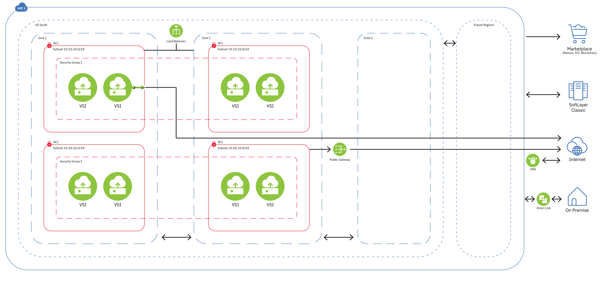

---

copyright:
  years: 2018
lastupdated: "2018-08-03"

---

{:shortdesc: .shortdesc}
{:new_window: target="_blank"}
{:codeblock: .codeblock}
{:pre: .pre}
{:screen: .screen}
{:tip: .tip}
{:download: .download}

# Using an IBM Cloud VPC with regions and subnets

This document gives an overview of the available (or restricted) IP address ranges and user actions pertaining to regions and subnets. For step-by-step instructions on setting up your subnets:

 * If you prefer using the `ibmcloud` CLI, please refer to our [Example Code tutorial](example-code.html).

 * If you prefer to use the IBM Cloud Console UI, please see our [Console Tutorial](console-tutorial.html).

## IBM Cloud VPC and Regions

An {{site.data.keyword.cloud}} VPC spans multiple regions. Each region contains multiple Zones, which represent independent fault domains.

**Notes for Beta release:**

 * **For Beta release, there is only one region and one zone.**
 * **For the Beta release, you have to create your VPC before you create your subnet(s) within that VPC.**
 * **IPv6 support is not available in the Beta release.**

## IBM Cloud VPC and Subnets

Customers can divide an IBM Cloud VPC into subnets. (A subnet consists of an IP address range that you specify, and it is bound to a single Zone, which cannot span multiple Zones or Regions.) A subnet can span the entirety of the Zone in the IBM Cloud VPC. 

All the subnets in an IBM Cloud VPC can reach one another though private L3 routing by an implicit router. The customer does not need to set up any routers or routes.

CIDRs are allocated to each Zone. Customers can pick a range of IP addresses from the existing CIDRs for the new subnet. If the Zone CIDR is not suitable, one of the existing CIDRs can be edited or a new CIDR can be added to Zone. These are available IP addresses, as defined in **RFC 1918**.

 * 10.0.0.0 – 10.255.255.255
 * 172.16.0.0 – 172.31.255.255
 * 192.168.0.0 – 192.168.255.255

### The following addresses are reserved addresses in a subnet:

  * Network address (first address in the CIDR range)
  * Default gateway address (second address in the CIDR range)
  * Name server (Third address in the CIDR range)
  * Reserved address (4th address in the CIDR range)
  * Broadcast address (last address in the CIDR range)

### Creating a Subnet:
  * You can create a subnet by providing the size of subnet you need, such as the number of addresses supported (for example, 1024)
  * You can create a subnet by providing a CIDR range (such as 10.0.0.1/29)

### Deleting a Subnet:
  * You cannot delete a subnet if resources (such as a Virtual Server Instance (VSI)) are in use in that subnet, the resources must be deleted first.
  * You can associate or disassociate a VSI with a subnet (it requires vNIC addition and bandwidth selection)
  * You can NOT resize the existing subnet. For example, 10.10.10.0/24 cannot be resized to 10.5.1.3/20
