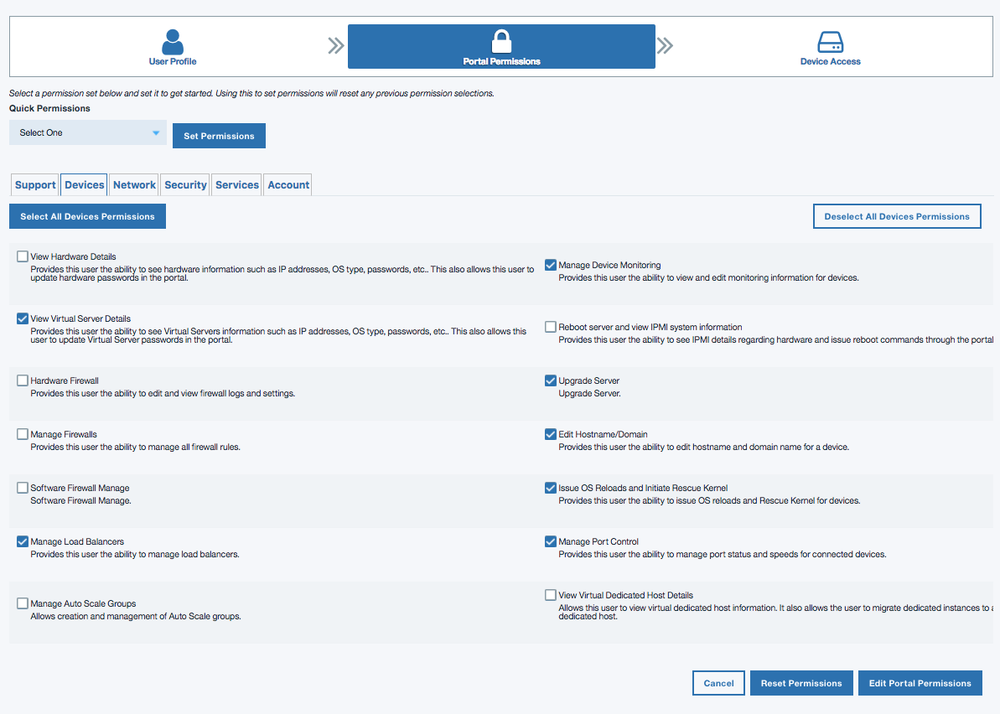
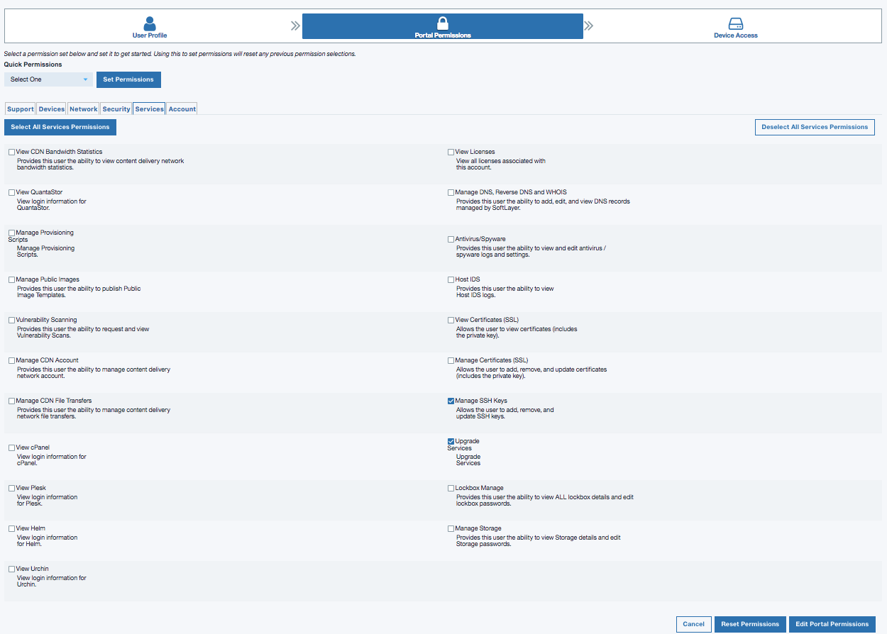
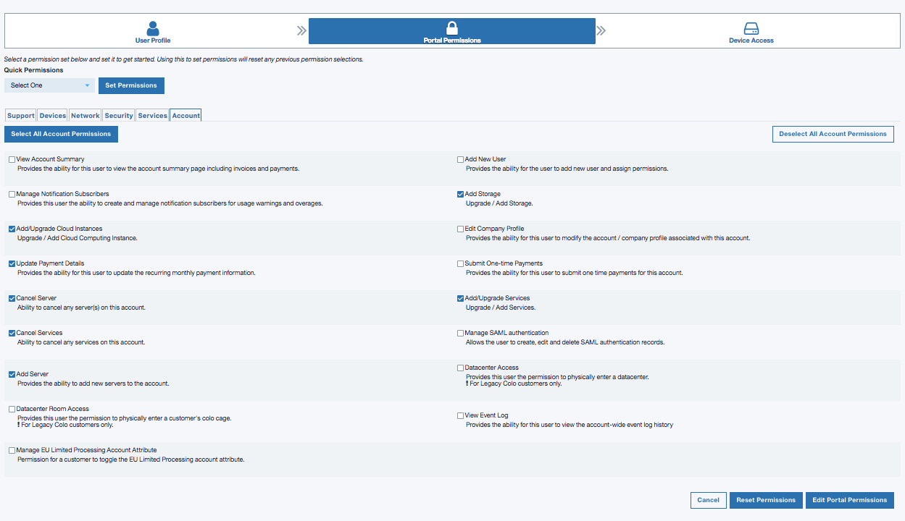
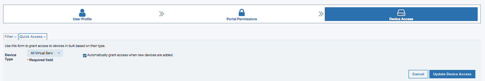

---

copyright:
  years: 2017, 2018
lastupdated: "2018-06-01"

---

{:shortdesc: .shortdesc}
{:new_window: target="_blank"}
{:codeblock: .codeblock}
{:pre: .pre}
{:screen: .screen}
{:tip: .tip}
{:download: .download}

# Granting Permissions Needed for VPC Users

Certain permissions must be granted so that an IBM Cloud VPC user can provision and manage resources such as servers and keys. The master of the account can add additional users to the IBM Cloud account and grant the required permissions.

1. Log in to the [IBM Cloud Portal ](https://console.bluemix.net/){: new_window} and make sure you are in the context of the correct account. To verify the correct account, click on the **Profile** icon on the top right corner and check the **Account** field. Click on the **Account** field to change to the correct account, if needed.
2. Navigate to **Manage > Account > Users**.
3. In the **Users** screen, click on the user that you wish to grant access.
4. In the **Access policies** tab, click on **Assign access +** button to begin assigning access.
5. In the Choose Access Type screen, click on the **Assign access to your SoftLayer account** button.
6. Click on the Portal Permissions section and the Devices tab.

  

  Click on the **Edit Portal Permissions** button to save the changes.

7. Still on the **Portal Permissions** section, click on the **Services** tab.

  

  Click on the **Edit Portal Permissions** button to save the changes.

8. Still on the **Portal Permissions** section, click on the **Account** tab.

  

  Click on the **Edit Portal Permissions** button to save the changes.

9. Click on the **Device Access** section and the **Quick Access** tab. From the drop down **Device Type** menu, choose **All Virtual Servers** and then click on the **Automatically grant access when new devices are added** checkbox.

  

  Click on the **Update Device Access** button to save the changes.
